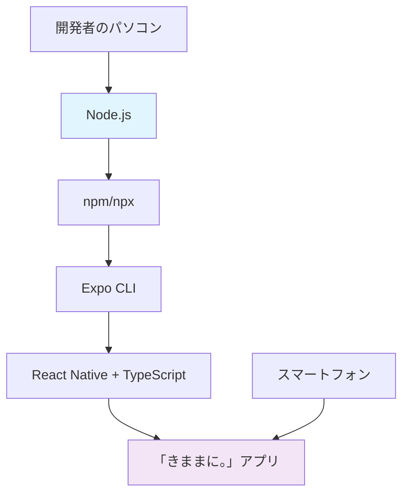

# 「きままに。」アプリ フロントエンド環境構築ガイド

## 📋 概要
React Native + Expo + TypeScriptによる「きままに。」アプリのフロントエンド開発環境構築手順書

**対象**: 開発者向けセットアップガイド（初学者対応）  
**所要時間**: 約30-45分  
**推奨環境**: Node.js 18.x以上、npm 8.x以上

---

## 🎓 基本概念の理解（初学者向け）

### **Node.js とは？**

**役割**: JavaScriptをブラウザ以外の環境（パソコン上）で実行するためのランタイム環境

```bash
# 例: JavaScriptファイルをパソコン上で実行
node hello.js  # hello.jsファイルを実行
```

**なぜ必要？**

- 通常JavaScriptはブラウザでしか動かない
- React Nativeアプリの開発・ビルド作業はパソコン上で行う
- Node.jsがあることで、開発ツールが動作可能になる

**身近な例**: スマホアプリを作るための「工場の機械」のようなもの

---

### **npm とは？**

**正式名称**: Node Package Manager  
**役割**: JavaScriptのライブラリ（パッケージ）を管理するツール

```bash
# 例: Reduxライブラリをプロジェクトに追加
npm install @reduxjs/toolkit

# 例: プロジェクトを起動
npm start
```

**なぜ必要？**

- 他の開発者が作った便利な機能（ライブラリ）を簡単に使える
- プロジェクトの依存関係を自動管理
- アプリの起動・ビルドコマンドを実行

**身近な例**: スマホの「App Store」のようなもの。必要なアプリ（ライブラリ）をダウンロード・管理

---

### **npx とは？**

**役割**: パッケージを一時的にダウンロードして実行するツール

```bash
# 例: プロジェクト作成ツールを一時的に使用
npx create-expo-app@latest my-app

# 毎回最新版を使用（インストール不要）
npx expo --version
```

**npmとの違い**:
- **npm**: パッケージをプロジェクトに永続的にインストール
- **npx**: パッケージを一時的に使用（使い捨て）

**なぜ便利？**
- プロジェクト作成など、一度だけ使うツールに最適
- 常に最新版を使用可能
- パソコンの容量を節約

**身近な例**: 「レンタカー」のようなもの。必要な時だけツールを借りて使用

---

### **Expo とは？**
**役割**: React Nativeアプリ開発を簡単にするプラットフォーム・フレームワーク

```bash
# 例: Expoプロジェクト作成
npx create-expo-app@latest my-app

# 例: 開発サーバー起動
npm start  # Expo開発サーバーが起動
```

**Expoが提供するもの**:
1. **簡単なプロジェクト作成**: 複雑な設定が不要
2. **ライブリロード**: コード変更が即座にアプリに反映
3. **実機テスト**: QRコードでスマホアプリをテスト
4. **便利な機能**: カメラ、位置情報、プッシュ通知など

**従来のReact Nativeとの違い**:
- **従来**: Android Studio、Xcodeなど重いツールが必要
- **Expo**: ブラウザとスマホアプリだけで開発可能

**身近な例**: 「レゴブロック」のようなもの。複雑な部品は既に作られており、組み合わせるだけでアプリが完成

---

### **TypeScript とは？**
**役割**: JavaScriptに型安全性を追加した言語

```typescript
// JavaScript（型なし）
function greet(name) {
  return "Hello " + name;
}

// TypeScript（型あり）
function greet(name: string): string {
  return "Hello " + name;
}
```

**なぜ使うのか？**
- **エラーの早期発見**: 実行前にバグを発見
- **コード補完**: エディタが自動で候補を表示
- **チーム開発**: コードの意図が明確になる

**身近な例**: 「設計図」のようなもの。建物を建てる前に図面で問題を発見

---

### **全体の関係性**



1. **Node.js**: JavaScriptをパソコンで実行可能にする
2. **npm/npx**: 開発に必要なツールを管理・実行
3. **Expo**: React Native開発を簡単にする
4. **TypeScript**: 安全で保守しやすいコードを書く
5. **最終成果物**: スマートフォンアプリ「きままに。」

---

## 🔧 前提条件

### **必要なソフトウェアの確認**

以下のコマンドを実行して、必要なソフトウェアがインストールされているか確認します：

```bash
# Node.js バージョン確認
node --version
# 期待する出力例: v16.20.2 または v18.x.x以上

# npm バージョン確認
npm --version  
# 期待する出力例: 8.19.4 または 9.x.x以上

# Expo CLI確認（一時的に実行）
npx expo --version
# 期待する出力例: 1.0.0以上
```

### **バージョン確認の意味**

**Node.jsのバージョンチェック**:
- アプリ開発に必要な機能が使えるか確認
- 古すぎると新しいライブラリが動かない
- 新しすぎると互換性問題が起こる場合がある

**npmのバージョンチェック**:
- パッケージインストール機能の確認
- セキュリティアップデートが適用されているか確認

**Expo CLI確認**:
- React Native開発ツールが利用可能か確認
- `npx`で毎回最新版を使用（インストール不要）

### **もしインストールされていない場合**

#### **Node.js & npm のインストール**
1. [Node.js公式サイト](https://nodejs.org/)にアクセス
2. 「LTS版」（推奨版）をダウンロード
3. インストーラーを実行
4. npmは自動的に一緒にインストールされます

#### **動作確認**
```bash
# インストール後、以下が表示されればOK
node --version  # バージョン番号が表示される
npm --version   # バージョン番号が表示される
```

---

## 🏗️ プロジェクト作成

### 1. ベースプロジェクト作成
```bash
# プロジェクトルートに移動
cd kimamani_app

# React Native + TypeScript プロジェクト作成
npx create-expo-app@latest kimamani-frontend

# プロジェクトディレクトリに移動
cd kimamani-frontend
```

**目的**: Expo Router + TypeScript環境の構築

---

## 📦 依存関係インストール

### **ライブラリとは？**
ライブラリ（パッケージ）とは、他の開発者が作った便利な機能をまとめたものです。  
**身近な例**: スマホアプリで「カメラ機能」「地図機能」を一から作るのは大変→既に作られた機能を借りてくる

---

### 2. 状態管理ライブラリ
```bash
npm install @reduxjs/toolkit react-redux
```

**何をインストールしているか？**
- `@reduxjs/toolkit`: アプリの状態管理を簡単にするツール
- `react-redux`: ReactとReduxを連携させるための橋渡し

**なぜ必要？**
「きままに。」アプリでは以下の情報を管理する必要があります：
- **ユーザー情報**: ログイン状態、プロフィール
- **位置情報**: 現在の場所、GPSの設定状況  
- **スポット情報**: お気に入り、検索履歴

**身近な例**: アプリ全体の「記憶装置」のようなもの

---

### 3. 位置情報・地図機能
```bash
npm install expo-location axios react-native-maps expo-maps
```

**何をインストールしているか？**
- `expo-location`: スマホのGPS情報を取得
- `axios`: インターネット通信（APIとの通信）
- `react-native-maps`: Google Mapsの表示
- `expo-maps`: Expo環境でのマップ機能強化

**なぜ必要？**
「きままに。」の核心機能です：
- **現在位置の取得**: ユーザーがどこにいるかを把握
- **近隣スポット取得**: サーバーからおすすめ情報を取得
- **地図表示**: 視覚的に場所を表示

**身近な例**: 
- `expo-location` = スマホの「GPS機能」
- `axios` = 「インターネット通信」
- Maps系 = 「Googleマップ」

---

### 4. UIコンポーネント
```bash
npm install react-native-elements react-native-paper react-native-vector-icons
npm install expo-linear-gradient
npm install --save-dev @types/react-native-vector-icons
```

**何をインストールしているか？**
- `react-native-elements`: 汎用的なUIパーツ（ボタン、カードなど）
- `react-native-paper`: Material Design（Googleデザイン）のUIパーツ
- `react-native-vector-icons`: アイコン集（ハート、星、矢印など）
- `expo-linear-gradient`: 美しいグラデーション効果
- `@types/react-native-vector-icons`: TypeScript用の型定義

**なぜ必要？**
美しく使いやすいアプリにするため：
- **統一されたデザイン**: プロのデザイナーが作ったUIを使用
- **豊富なアイコン**: 文字だけでなく視覚的に分かりやすく
- **美しい視覚効果**: グラデーションで魅力的な見た目に

**身近な例**: 
- UIライブラリ = 「デザインテンプレート集」
- アイコン = 「絵文字・ピクトグラム集」
- グラデーション = 「美しい色合いツール」

---

### **インストール時に起こること**

```bash
npm install パッケージ名
```

1. **ダウンロード**: インターネットからライブラリを取得
2. **保存**: `node_modules/`フォルダに保存
3. **記録**: `package.json`に依存関係を記録
4. **準備完了**: コード内で`import`して使用可能

**注意**: インターネット接続が必要です（初回のみ）

---

## 🏛️ プロジェクト構造構築

### 5. ディレクトリ作成
```bash
mkdir -p store/slices types services
```

### 6. Redux設定ファイル作成
```bash
# Redux store設定
touch store/index.ts

# 状態管理スライス作成
touch store/slices/authSlice.ts
touch store/slices/spotsSlice.ts
touch store/slices/locationSlice.ts
```

**各ファイルの役割**:
- `store/index.ts`: Redux Toolkit store設定
- `authSlice.ts`: ユーザー認証状態
- `spotsSlice.ts`: 観光スポット情報
- `locationSlice.ts`: 位置情報管理

---

## 📱 画面ファイル作成

### 7. 新規画面ファイル作成
```bash
# 追加画面作成
touch app/(tabs)/map.tsx
touch app/(tabs)/search.tsx
touch app/(tabs)/favorites.tsx
touch app/(tabs)/profile.tsx
```

### 8. 既存ファイル編集対象
- `app/_layout.tsx`: Redux Provider設定
- `app/(tabs)/_layout.tsx`: 5タブナビゲーション
- `app/(tabs)/index.tsx`: ホーム画面実装

---

## 📄 実装内容概要

### Redux Store (store/index.ts)
- `configureStore`による store設定
- TypeScript型安全hooks (`useAppDispatch`, `useAppSelector`)
- 3つのslice統合

### 認証管理 (authSlice.ts)
- ユーザー情報・JWTトークン管理
- ログイン・ログアウト処理

### スポット管理 (spotsSlice.ts)
- 近隣スポット検索・取得
- お気に入り機能
- カテゴリフィルタリング

### 位置情報管理 (locationSlice.ts)
- 現在位置取得・GPS権限
- 地図領域管理

### アプリレイアウト (_layout.tsx)
- Redux Provider
- SafeAreaProvider
- カスタムテーマ設定

### タブナビゲーション ((tabs)/_layout.tsx)
```typescript
// 5つのメインタブ
- きままに（index）: ホーム画面
- 地図（map）: 地図表示
- 検索（search）: スポット検索
- お気に入り（favorites）: 保存済みスポット
- プロフィール（profile）: ユーザー情報
```

### 各画面機能
1. **ホーム画面**: メイン機能、位置情報取得、近隣スポット
2. **地図画面**: 位置情報権限、マップ表示
3. **検索画面**: 検索バー、カテゴリフィルタ
4. **お気に入り画面**: 保存スポット一覧
5. **プロフィール画面**: ユーザー情報、設定

---

## 🚀 動作確認

### 9. アプリ起動
```bash
# 重要: kimamani-frontend ディレクトリで実行
pwd  # /path/to/kimamani_app/kimamani-frontend

# Web版起動
npm run web

# または開発サーバー起動
npm start
```

### 10. 確認ポイント
- ✅ 5つのタブが表示される
- ✅ タブ間ナビゲーション動作
- ✅ 位置情報権限要求（地図タブ）
- ✅ 各画面のUI表示

---

## 🔍 トラブルシューティング

### よくあるエラー

#### package.json not found
```bash
# 解決: 正しいディレクトリに移動
cd kimamani-frontend
```

#### Node.js バージョン警告
```bash
# 解決: Node.js 18以上推奨
nvm install 18 && nvm use 18
```

#### Expo CLI エラー
```bash
# 解決: 直接npmでインストール
npm install expo-linear-gradient
```

---

## 📂 最終プロジェクト構造

```
kimamani-frontend/
├── app/
│   ├── (tabs)/
│   │   ├── _layout.tsx    # タブナビ設定
│   │   ├── index.tsx      # ホーム画面
│   │   ├── map.tsx        # 地図画面
│   │   ├── search.tsx     # 検索画面
│   │   ├── favorites.tsx  # お気に入り
│   │   └── profile.tsx    # プロフィール
│   └── _layout.tsx        # アプリルート
├── store/
│   ├── index.ts           # Redux store
│   └── slices/
│       ├── authSlice.ts   # 認証管理
│       ├── spotsSlice.ts  # スポット管理
│       └── locationSlice.ts # 位置情報
├── types/                 # 型定義
├── services/              # API通信
└── package.json           # 依存関係
```

---

## ✅ 完了チェックリスト

### 基本環境
- [ ] Node.js 16.x以上インストール済み
- [ ] Expo CLI利用可能

### プロジェクト
- [ ] kimamani-frontend作成済み
- [ ] 全依存関係インストール済み
- [ ] Redux store設定完了
- [ ] 5画面作成完了

### 動作確認
- [ ] `npm start`で起動成功
- [ ] 全タブ表示・動作確認
- [ ] 位置情報機能動作確認

---

## 📚 参考情報

- [Expo Documentation](https://docs.expo.dev/)
- [Redux Toolkit](https://redux-toolkit.js.org/)
- [React Native](https://reactnative.dev/)

**注意**: 本手順はmacOS環境での検証に基づきます。Windows/Linux環境では一部コマンドが異なる場合があります。

---

*作成日: 2025年6月28日*  
*対象バージョン: Expo SDK 51.x, React Native 0.74.x*
